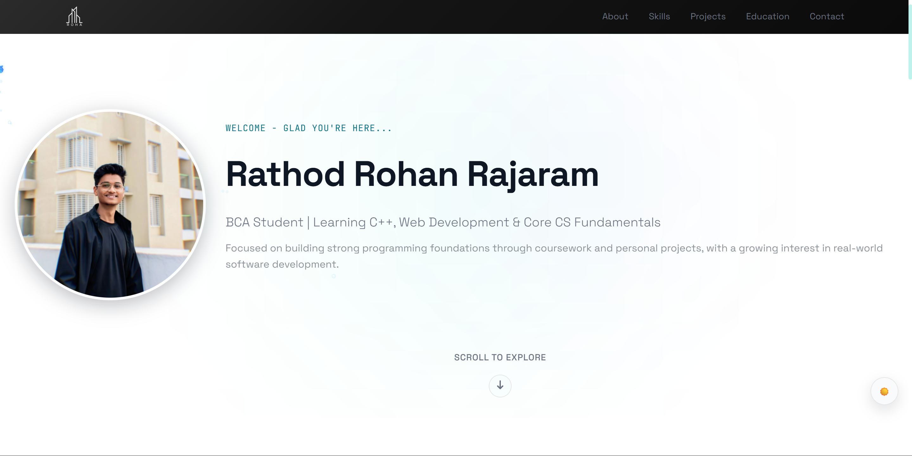

<h1 align="center">💼 Personal Portfolio Website</h1>

<p align="center">
A personal portfolio website showcasing my projects, skills, and experience in web development.
Built using HTML, CSS, and JavaScript with EmailJS for contact form functionality.
</p>

---

## 🚀 Features

* Responsive portfolio website
* About section introducing the developer
* Projects section highlighting work
* Contact form integrated with EmailJS
* Smooth UI and modern layout
* Social media links

---

## 🛠️ Technologies Used

* **HTML5**
* **CSS3**
* **JavaScript**
* **EmailJS**

---

## 🌐 Live Website

You can view the portfolio here:

**https://rohanrathodonline.github.io/Portfolio/**

---

## 📂 Project Structure

```
Portfolio
│
├── index.html
├── CSS/
│   └── styles.css
├── JS/
│   └── script-vanilla.js
├── ASSETS/
│   └── images and media files
├── README.md
└── TODO.md
```

---

## 📸 Preview

<p align="center">
  
</p>


---

## 📈 Future Improvements

* Add project filtering
* Improve animations
* Add blog section
* Improve mobile responsiveness

---

## 👨‍💻 Author

**Rohan Rathod**

